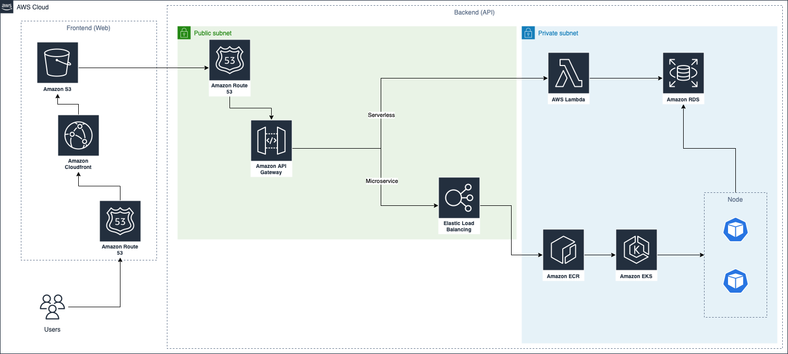
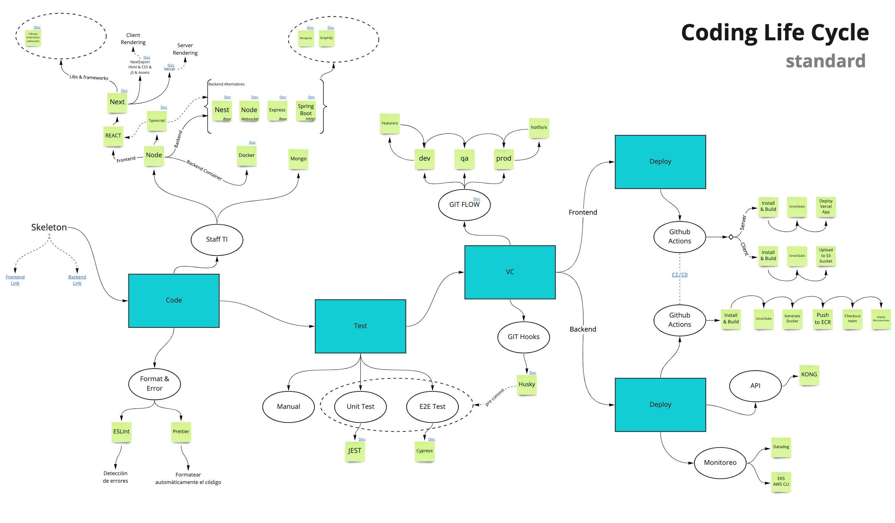

## Description

Este proyecto se encuentra desarrollado sobre NestJS, utiliza Redis para almacenamiento de Cache. No ocupa base de datos.

Dependencias:
- Redislab (cache)
- Husky: precommit validation
- Jest: Unit testing

## Installation

```bash
$ yarn install
```
or 

```bash
$ npm install
```

## Running the app

With Yarn 
```bash
# development
$ yarn start

# watch mode
$ yarn start:dev
```

With npm
```bash
# development
$ npm run start

# watch mode
$ npm run start:dev
```

## Test

```bash
# unit tests
$ yarn test
```

## Accesos

API disponible en localhost:3000

## Escalamiento y deployments

### ¿Qué factores considerarías para decidir si esta API la deberías instalar en una infraestructura gestionada tipo Kubernetes o instalarla en un componente serverless tipo CloudRun ( o fargate)

Uso de kubernetes evaluando los siguientes casos:
- Necesidad de usar CI/CD
- Si la aplicación en el futuro va a escalar en nuevas funcionalidades
- Va a ser constantemente utilizada (no uso esporadico contra solicitud)

Uso de serverless evaluando los siguientes casos:
- La aplicación no escalará en nuevas funcionalidades y mantendrá el mismo objetivo.
- No requiere CI/CD

### ¿Qué fases debería contener tu CI/CD?
Idea de pipeline de alto nivel
1. npm install
2. run test 
3. run sonar 
4. npm build
5. Docker 
6. Upload image 
7. Deploy image in sk8 (AWS example)


## Seguridad

### ¿Qué componentes usarías para securitizar la exposición de tu API?. 

Si trabaja sobre microservicios, cada POD no debe estar expuesto a internet sino que se accede mediante un ingress que puede estar sobre algun Api Manager como Kong o un gestor de API con API Gateway (más básico). 

Antes de ingresar al sistema debe considerar:
- Solicitud filtrada por un WAF 
- Recibir un usuario autenticado (Ejemplo JWT valido), ya sea usuario persona real logueada o usuario sistema para solicitudes "públicas"
- Validar cantidad de solicitudes esperadas vs solicitudes reales (Limitar)


### ¿Cómo asegurarías la seguridad de tu API desde el ciclo de vida de desarrollo?
Si consideramos acceso siempre para usuarios logueados
- Validación de headers (Ejemplo authorization)
- En base a header obtener información del usuario
- Configurar cada API con requerimientos de permisos especificos (Ejemplo permiso para obtener canciones)
- Obtener perfilamiento de usuario para considerar si cuenta con permiso de acceder a API 

## Diagrama de componentes

Diagrama de alto nivel con uso de microservicios o funciones lambda bajo AWS.

Herramiento utilizada draw.io

<p align="center">
  
</p>

## Información adcional

### Coding Life Cycle

Una propuesta para ciclo de vida de un proyecto considerando las siguientes etapas:

- Code: Stack tecnológico, librerias esenciales
- Test: Testing automatizado (unitario, integración, etc) con validaciones de código automático antes de commit (este proyecto cuenta con husky instalado como ejemplo)
- Vercionamiento: Ciclo de vida usando github con git flow
- Deploy: Un ejemplo de deploy para proyectos frontend y backend

<p align="center">
  
</p>


